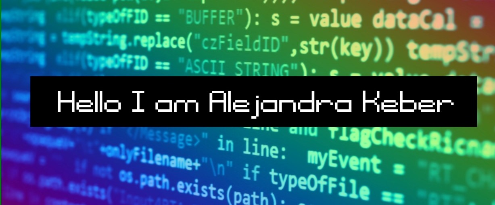

 

Linkedin: 

- 📝 I’m currently studying full-stack development at Microverse

- 🌱 I’m currently learning HTML, CSS and javaScript

- 👯 I’m looking to collaborate on front-end projects

- 👋 I'm currently on the lookout for new opportunities

- 📫 How to reach me: alejandrakeber@gmail.com

